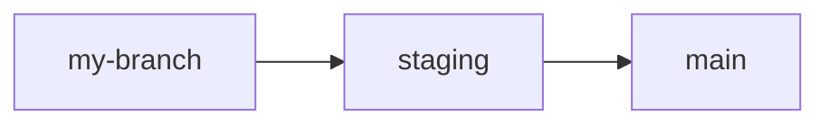

### [CLICK HERE TO READ INSTRUCTIONS (delete afterwards)](#template-instructions)

# Repository Name

[](https://github.com/yappify/template/blob/main/LICENSE)  

Lead maintainer: [@abyanmajid](https://github.com/abyanmajid) (change as needed) \
Documentation: Link to documentation here...

Reference for markdown badges: [Markdown Badges](https://github.com/Ileriayo/markdown-badges) (delete this line)

Write the description for your repository here. You may also add other sections e.g., for describing the architecture of your solution, etc.

## Contributing
List the step-by-step procedure which others can follow to make a contribution. For example:
```
git clone https://github.com/yappify/template.git .
git checkout -b my-branch
make build
make run
```

Or, run in a docker container
```
cd docker && docker run
```

## Template Instructions

The template contains the following:

- `.github/workflows/cicd.yml` - This is where you write your YAML script for CI/CD using GitHub Actions (including automated testing and deployment to cloud)
- `.gitattributes` - This is where you put any attributes for git and GitHub, if there is any
- `.gitignore` - This is where you specify files to exclude out of version control
- `Makefile` - This is where you write your `make` script for convenient building of your solution

Start working by adding your own files and folders as needed.

### Git workflow

You should follow this process to modify the remote repository:

1. Create a new branch for development.
2. After finishing a feature, submit a pull request to `staging` and merge (this will reflect the changes in the staging deployment).
3. If there are no issues in staging, make a pull request to `main` and merge (this will reflect the changes in production).


